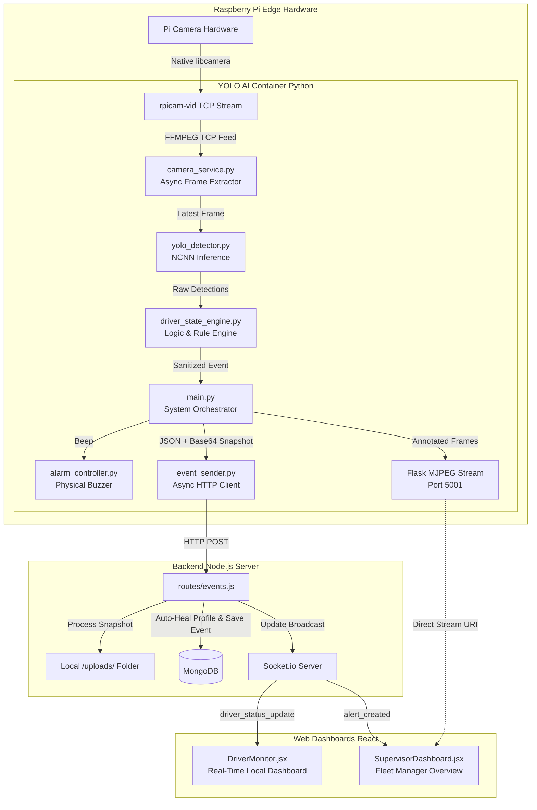

# Driver Monitoring System (DMS) – Technical Documentation

This documentation provides a comprehensive architectural breakdown of the **Edge-Optimized Driver Monitoring System (DMS)**. It is designed to track driver behavior in real-time, compute safety risk scores, trigger localized physical alarms, and intelligently syndicate statistical data to remote React dashboards via WebSocket pipelines.

---

## 1. System Architecture Overview

The system utilizes a 3-tier microservice architecture completely containerized inside Docker, deployed natively onto an Edge Device (e.g., Raspberry Pi 5). 

1. **Computer Vision Edge Nodes (Python/YOLO)**: Processes real-time hardware camera feeds at 0-latency using NCNN-compiled Ultralytics custom models.
2. **Backend API & Logic Engine (Node.js/Express/MongoDB)**: A centralized data hub bridging statistical AI findings, driver profiling logic, scoring deductions, and hardware REST endpoints.
3. **Real-time Web Dashboards (React.js/Vite)**: Bi-directional Socket.io connected dashboards enabling real-time graphical analytics and fleet monitoring.

### High-Level Interaction Diagram


---

## 2. Core Project Components & Functionality

### 2.1 The AI Translation Engine (`driver_state_engine.py`)
Custom-trained Object Detection models strictly return raw labels defined by their dataset (e.g. `'my-phone'`, `'smoke'`, `'0'`, `'Seat-belt'`). The Engine mathematically unifies these arbitrary string identities into standardized Mongoose Database Enums.

* **Immediate Triggers**: Events like `"PHONE_USAGE"` instantly break the feedback loop and sound alarms.
* **Time-Based Triggers**: To detect driver absence, the engine executes spatial logic. Because YOLO detects presence, not absence, the engine calculates a **"No Face"** violation if `len(detections) == 0` lasts longer than 2 consecutive seconds.

```python
# snippet from driver_state_engine.py
self.EVENT_MAP = {
    "my-phone": "PHONE_USAGE", # Intercepts custom YOLO tag
    "0": "DROWSINESS",         # Solves missing-label class
    "smoke": "DISTRACTION",    
    "seat-belt": "NO_SEATBELT"
}

# No Face trigger by calculating detection absence
no_detections_at_all = (len(detections) == 0)
if no_detections_at_all:
   # Start 2.0s Tracker
```

### 2.2 The Asynchronous Frame Extractor (`camera_service.py`)
Reading high-definition camera feeds over TCP buffers synchronously causes massive buffer backlogs, leading to severe latency (1-5 second delays). The `CameraService` class executes OpenCV `VideoCapture` inside a discrete background Daemon thread. 

```python
def _opencv_reader(self):
    while self.is_running:
        if self.cam and self.cam.isOpened():
            ret, frame = self.cam.read()
            if ret:
                self.latest_frame = frame
        else:
            # Aggressive Hardware Reconnection protocol 
            time.sleep(2)
            self.cam = cv2.VideoCapture(self.cam_source, cv2.CAP_FFMPEG)
```
This guarantees that `get_frame()` mathematically retrieves the exact active millisecond frame at true 0-latency.

### 2.3 The HTTP Backend Transmitter (`event_sender.py`)
To prevent the main edge loop from hanging while making HTTP Web Requests to a local server, Python's `threading` is leveraged to isolate the TCP handshake.
Simultaneously, the script bypasses image uploads by `Base64` encoding the exact `NumPy` array matrix where the violation occurred, pushing it natively inside the JSON Payload.

### 2.4 The Auto-Healing Server Node (`routes/events.js`)
When an Edge device initializes in a prototype environment, complex JWT or persistent Driver Authentication Tokens can be absent from headless containers.
The backend API incorporates an "Auto-Healing" algorithm. If an event Payload strikes the API from configuring Edge Hardware, the server gracefully checks the MongoDB for an active user. If a `DriverProfile` Document is mathematically missing, it automatically crafts a phantom registration profile without throwing database Validation errors, ensuring 100% statistical preservation.

```javascript
// Inherently forgives disconnected Test Identifiers
let defaultProfile = await DriverProfile.findOne();

if (!defaultProfile) {
    const firstUser = await User.findOne();
    defaultProfile = await DriverProfile.create({
        userId: firstUser._id,
        licenseNumber: "AUTO-GEN-" + Math.floor(Math.random() * 10000),
        vehicleId: "AUTO-VEH-" + Math.floor(Math.random() * 10000)
    });
}
```

### 2.5 Multi-Target Real-Time UI Analytics (`DriverMonitor.jsx` & `SupervisorDashboard.jsx`)
The dashboards reject standard HTTP Polling via Axios, exclusively tapping directly into the Socket.io instances bound to Express.js. 

When the local AI detects `.smoke`, it travels up the pipeline, triggering `driver_status_update`. The UI physically modifies `useState` Hooks in micro-milliseconds, manipulating the onscreen metrics while avoiding strict User ID validations to act as a universal Edge Screen.

```javascript
socketRef.current.on('driver_status_update', (profileUpdate) => {
    // Dynamically increment onscreen hooks matching the Mongoose Database Enums
    if (profileUpdate.currentStatus === 'DROWSINESS') setBlinkCount(prev => prev + 1);
    if (profileUpdate.currentStatus === 'PHONE_USAGE') setPhoneCount(prev => prev + 1);
});
```

The Fleet Supervisor page utilizes advanced `Recharts` graph libraries to visualize cumulative spatial data (`eventFrequency`) directly from these Socket broadcasts, acting as a real-time command center.

---

## 3. Deployment Workflow Integration
The entire ecosystem spans across standard Linux daemon processes and Docker network configurations using `docker-compose.yml`.

- **Internal Host Mapping**: Bypasses external internet. Subnet internal DNS mappings (e.g. `http://backend:5000/api/events`) restrict data travel physically within the hardware microchip layout, mitigating external WiFi packet loss.
- **Strict Data Mongoose Ecosystems**: Synchronizes Schema data constraints (`NO_SEATBELT`, `DROWSINESS`) directly between Node.js logic checks and React GUI variables ensuring safe typed variables end-to-end.

---

## 4. Technologies Used

**Hardware & Operating System**
*   **Raspberry Pi 5**: Primary edge computing node.
*   **libcamera / rpicam-vid**: High-performance native camera interface for Raspberry Pi hardware.

**Computer Vision Edge Container**
*   **Python 3.11**: Ecosystem runtime for the AI models.
*   **OpenCV (cv2) / FFMPEG**: Core visual streaming, frame extraction, and MJPEG broadcasting logic over TCP.
*   **Ultralytics (YOLO) & NCNN**: Deep Learning framework compiled specifically for high-speed edge hardware inference to bypass heavy PyTorch overhead.
*   **Flask**: Lightweight synchronous web server used explicitly for serving the real-time MJPEG debug video feed across the internal Docker subnet.

**Backend Server Container**
*   **Node.js & Express.js**: High-throughput REST API interface to ingest high-frequency YOLO AI events.
*   **MongoDB & Mongoose**: NoSQL persistent storage utilizing extremely strict Schema Validation Enums (`['DROWSINESS', 'NO_SEATBELT']`) to enforce data consistency.
*   **Socket.io**: Real-time bidirectional event-based communication library connecting the backend organically to the React Dashboards.

**Frontend Dashboard Container**
*   **React.js (Vite)**: Component-based UI rendering engine.
*   **Recharts**: Composable charting library to render dynamic statistical arrays based directly on incoming Socket.io payloads.

**Deployment Architecture**
*   **Docker & Docker Compose**: Complete microservice containerization, establishing internal non-internet-reliant subnets for secure, 0-latency TCP packet transfers.

---

## 5. System Outputs

When the system detects an active violation, it executes a cascading wave of physical and digital outputs across the architecture simultaneously:

1.  **Auditory Hardware Alarms (Local)**: The edge device immediately physically sounds a `BEEP` (via physical Buzzer or Terminal Chime) depending on the evaluated Severity configuration (`LOW`, `MEDIUM`, `HIGH`, `CRITICAL`).
2.  **Database Persistence (Centralized)**: The Node.js server physically creates an `Event` Schema inside MongoDB preserving the precise `confidence` score, the translation enum, and deducts contextual points mathematically off the active `DriverProfile` Safety Score.
3.  **Real-time Base64 Snapshots (Archival)**: Natively encodes the exact `NumPy` violation frame over the HTTP request and archives it directly into the Backend `/uploads/` file system directory, attaching the URL statically to the Database schema.
4.  **Local Driver Dashboard Analytics (Visual)**: Fires the `driver_status_update` localized WebSocket push. The edge screen actively flashes the contextual Warning Badge (e.g., Orange for Distraction, Red for Drowsiness) and statically ticks the lifetime statistical integers upward.
5.  **Fleet Manager Live Stream (Remote Visual)**: Emits `new_alert` to the remote Supervisor Panel. The `Recharts` graph mathematically recompiles, and the Manager can optionally tap directly into the MJPEG internal port (`5001`) to view a live 10-FPS feed of the driver with YOLO bounding boxes actively drawn on the overlay.
